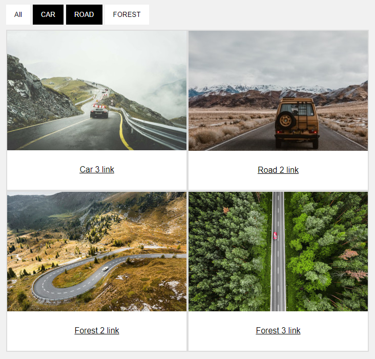

# Clear JS Hashtag Gallery (clearJsGallery)

## Галерея картинок с хештегами, без использования библиотек

## Пример

[https://datorik.github.io/clearJsGallery](https://datorik.github.io/clearJsGallery/index-ru.html)

### Скриншот



### Установка
```
Просто добавьте её код на страницу
```
### Настройка
Init
```
new clearJsGallery(galleryImagesList, settings);
```
galleryImagesList
```
'example.jpg': { //Image name
                    name: 'Example',
                    linkText: 'example',
                    link: '/',
                    hashtag: ['EXAMPLE', 'EXAMPLE2'] // one or more  hashtag
                }
```
settings
```
{
    multiSelection: true,
    imageLink: true,
    showTextLink: true,
    allBtnText: 'All', // all button text
    selectType: 'AND', // 'AND' or 'ALL'
    btnContainerID: 'clearJSgalleryBtnContainer', // button container ID
    rowContainerID: 'clearJSgalleryRowContainer', // gallery container ID
    imagesDir: 'images/' // images directory
}
```

## Лицензия

Этот проект распространяется под лицензией MIT - подробности в файле [LICENSE](LICENSE)

[English readme](readme.md)

